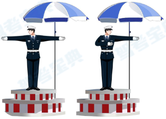
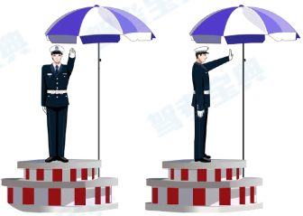
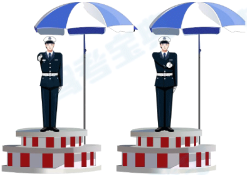
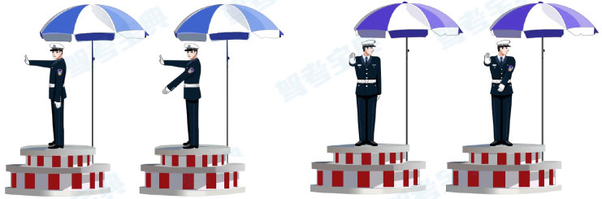
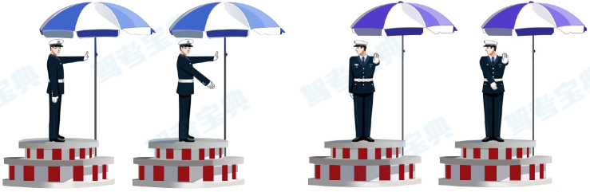
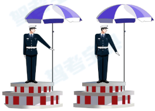
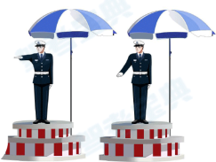

# 交警手勢

1. `直行`
    * 相片
        
    * 手勢
        * `雙`手中間
2. `停止`
    * 相片
        
    * 手勢
        * `左`手中間
3. `變道`
    * 相片
        
    * 手勢
        * `右`手中間擺
4. `左轉彎`
    * 相片
        
    * 手勢
        * `右`掌心前`左`手下
    * 口訣
        * 看見臂章左轉彎
5. `右轉彎`
    * 相片
        
    * 手勢
        * `左`掌心前`右`手下
    * 口訣
        * 反`左轉彎`
6. `左轉彎待轉`
    * 相片
        
    * 手勢
        * 只`左`手下
7. `減速慢行`
    * 相片
        
    * 手勢
        * 只`右`手下
    * 口訣
        * 反`左轉彎待轉`