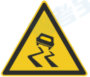
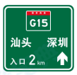
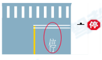
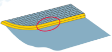

# 交通標誌線

## 警示

* 黃色三角形

### `彎路`

1. `急彎路`
    * 相片
        
2. `反向彎路`
    * 相片
        
3. `連續彎路`
    * 相片
        
* 口訣
    * 一`急`二`反`三`連續`

### `窄`

1. `兩側變窄`
    * 相片
        
2. `窄橋`
    * 相片
        
* 口訣
    * 窄橋上下`一樣寬`，窄路`上窄下寬`

### `路段`

1. `事故易發路段`
    * 相片
        
2. `易滑路段`
    * 相片
        
3. `堤壩路`
    * 相片
        
* 口訣
    * `相撞`事故，`有彎`易滑，`有浪`堤壩

### 山路類

1. `傍山險路`
    * 相片
        
2. `注意落石`
    * 相片
        
* 口訣
    * `無`石傍山，`有`石落石

### 凹凸類

1. `路面高突or減速丘`
    * `路面高突`是舊歸叫法，`減速丘`世新規叫法
    * 相片
        
2. `路面不平`
    * 橋頭跳車
    * 相片
        
3. `路面低窪`
    * 相片
        
4. `駝峰橋`
    * 相片
        
* 口訣
    * `一凸`高凸，`二凸`不平，`凹陷`低窪，`門洞`找橋

### `鐵路`

1. `無人看守鐵路道口`
    * 相片
        
2. `有人看守鐵路道口`
    * 相片
        
* 口訣
    * `火車`無人，`柵欄`有人

### 注意類

1. `注意危險`
    * 相片
        
2. `注意野生動物`
    * 相片
        
3. `注意牲畜`
    * 相片
        
4. `注意合流`
    * 相片
        
5. `注意行人`
    * 相片
        
6. `注意殘疾人`
    * 中共國對`身體障礙人士`之稱呼
    * 相片
        
7. `注意兒童`
    * 相片
        

## 其他

1. `雙向交通`
    * 相片
        

## 禁令

* 紅色，多為圓形

### 通行、駛入、進入

1. `禁止通行`
    * 包括`人`和`車`
    * 相片
        
2. `禁止駛入`
    * 只包括`車`
    * 相片
        
3. `禁止機動車駛入`
    * 相片
        
4. `禁止小型客車駛入`
    * 相片
        
5. `禁止非機動車進入`
    * 相片
        
6. `禁止電動自行車進入`
    * 相片
        
* 口訣
    * `白圈`全禁，`白橫`禁車，`正面`機動，`側面`小客，`後輪有槓`電動腳踏車，`後輪無槓`非機動

###  超車

1. `禁止超車`
    * 相片
        
2. `解除禁止超車`
    * 相片
        

### 限制

1. `限制寬度`
    * 相片
        
2. `限制高度`
    * 相片
        
* 口訣
    * `左右`寬度，`上下`高度

### 停放

* 公車站 `30` 公尺內不能停
1. `禁止車輛長時停放`
    * 相片
        
2. `禁止車輛停放`
    * 相片
        
* 口訣
    * `一斜`長停，`二斜`停放

### 停車、讓行

1. `停車檢查`
    * 相片
        
2. `停車讓行`
    * 相片
        
3. `減速讓行`
    * 相片
        
4. `會車讓行`
    * 相片
        
* 口訣
    * `檢查`停檢，`停`字停讓，`讓`字減讓，`黑下紅上`會車讓
    
### 道路

1. `右側通行`
    * 相片
        
2. `兩側通行`
    * 相片
        

## 其他標誌

1. `右側通行`
    * 相片
        
2. `兩側通行`
    * 相片
        

### 車道類

1. `分向行駛車道`
    * 相片
        
2. `多乘員車道專用車道`
    * 相片
        
3. `BRT專用車道`
    * 相片
        
4. `只准直行`
    * 相片
        
5. `單行道`
    * 相片
        
6. `直行車道`
    * 相片
        
7. `交叉路口`
    * 相片
        
8. `錯車道`
    * 相片
        
9. `會車先行`
    * 相片
        
10. `人行橫道`
    * 相片
        
* 口訣
    1. `3+`多乘員，`快速公交`BRT
    2. `藍圓`只直，`藍方`單行，`藍虛`直道
    3. `直曲`錯車道
    4. `紅下白上`會車先行

### 高速類

1. `高速公路入口預告`
    * 相片
        
2. `高速公路起點`
    * 相片
        
3. `高速公路終點`
    * 相片
        
4. `ETC車道`
    * 相片
        
5. `人工收費車道`
    * 相片
        
6. `停車區預告`
    * 相片
        
7. `服務區預告`
    * 相片
        
8. `緊急停車帶`
    * 相片
        
* 口訣
    1. `有距離`入口預告，`無槓`起點，`有槓`終點
    2. `ETC`ETC，`有人`人工收費
    3. `P與咖啡`停車區，`物品多`服務區

### 電話

1. `救援電話`
    * 相片
        
2. `緊急電話`
    * 相片
        
* 口訣
    1. `1212`救援電話，`只有電話`緊急電話

### 道路編號

1. `國道`
    * 相片
        
2. `省道`
    * 相片
        
3. `縣道`
    * 相片
        
4. `鄉道`
    * 相片
        
* 口訣
    1. `紅G`國道，`黃S`省道，`白X`縣道，`白Y`鄉道

### 其他

1. `應急避難設施`
    * 相片
        

## 標線

### 車道

1. `同向車道`
    * 相片
        
2. `對向車道`
    * 相片
        
3. `實虛車道`
    * 相片
        
    * 實線不可跨，虛線可跨
4. `三車行道變為雙車行道漸變段標線`
    * 相片
        
5. `人行橫道預告`
    * 相片
        
* 口訣
    1. `白色`同向，`黃色`對向，`實`不可跨，`虛`可跨
    2. `左三右雙車道`三變雙車道
    3. `白菱形`人行橫道預告，`白影`不得壓線行駛

### 停止、停車

1. `停止線`
    * 相片
        
2. `停車讓行線`
    * 相片
        
3. `禁止停車線`
    * 相片
        
4. `禁止長時停車線`
    * 相片
        
5. `網狀線`
    * 相片
        
    * 不得停車
6. `港灣式停靠站標線`
    * 相片
        
* 口訣
    1. `單白線`停止線，`雙白線`停車讓行線，`黃網`不得停，`黃實線`禁止停車
    2. `黃虛線`禁止長時停車，`有凸出`港灣停靠

### 減速

1. `減速讓行線`
    * 相片
        
2. `橫向減速標線`
    * 相片
        
3. `縱向減速標線`
    * 相片
        
* 口訣
    1. `白虛線`減讓，`2x3 白線`橫減，`左右白線`縱減

### 轉掉

1. `左彎或向左合流`
    * 相片
        
2. `左轉`
    * 相片
        
3. `禁止掉頭`
    * 相片
        
4. `左彎待轉曲線`
    * 相片
        
5. `路口導向線`
    * 相片
        
6. `可變導向車道線`
    * 相片
        
* 口訣
    1. `無角`彎或合流，`有角`轉，`錯拐彎`進掉頭
    2. `左凸出`待轉區，`虛斜線`導向線，`無箭頭`可變導向

### 其他

1. `接近障礙物標線`
    * 相片
        
2. `立面標記`
    * 相片
        