# 燈光儀表桿

## 燈光

1. `近光燈`
    * 
    * `夜間起步`、`跟車`、`交叉路口`、`隧道`
2. `遠光燈`
    * 
    * 只有`夜間照明不良的路段`才能開
    * 會車 `150` 公尺外改為 `近光燈`
3. `前後位燈or示廊燈`
    
4. `危險報警閃光燈`
    * 
    * `牽引故障車`、`車輛發生故障`、`低能見度`、`臨時停車`
5. `前霧燈`
    
6. `後霧燈`
    
7. `左轉向燈`
    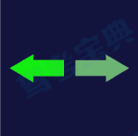
8. `右轉向燈`
    
9. `遠近交替`
    * `遠`、`近`光燈各閃一下
    * `夜間急彎`、`坡道`、`人行橫道`、`超車`、`提醒會車關遠燈`、`夜間無信號燈路口`

### 關鍵詞

1. 斜近平遠，對稱位置燈，中穿曲線為霧燈
2. 左前右後

## 儀表

1. `發動機轉速錶`
    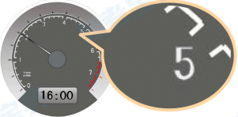
2. `速度與里程錶`
    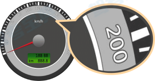
3. `水溫錶`
    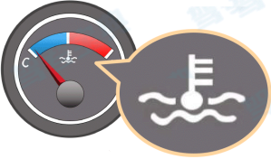
4. `燃油錶`
    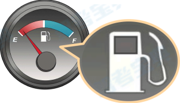

### 關鍵詞

1. 有 `r` 轉速
2. 有 `km/h` 速度
3. 有 `C` (cold) `H` (hot) 水溫
4. 有 `E` (empty) `F` (full) 燃油

## 操縱裝置

1. `燈光桿`
    * 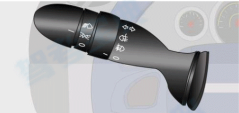
    * 下`左`上`右`
2. `刮雨桿`
    * 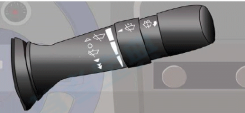
    * 前`扇`後`方`
3. `踏板`
    * 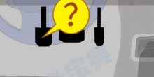
    * 從左至右：`離合` -> `制動` -> `加速`
4. `啟動`
    * 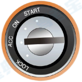
    1. `LOCK`
        * 切斷電源，鎖定方向盤
    2. `ACC`
        * 接通附件電源
    3. `ON`
        * 接通全部電源，車用電器可用
    4. `START`
        * 啟動機啟動

## 儀表指示燈

1. `行李艙蓋開啟`
    * 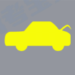
2. `發動機罩開啟`
    * 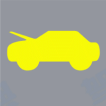
3. `兩側車門未關閉`
    * 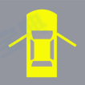
4. `右側車門未關閉`
    * 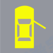
5. `左側車門未關閉`
    * 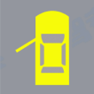
6. `沒系好安全帶`
    * 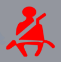
7. `車燈總開關`
    * 
8. `冷風暖氣風扇`
    * 
9. `空氣內循環`
    * 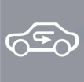
10. `空氣外循環`
    * 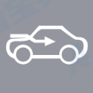
11. `前風窗玻璃刮水器`
    * 
12. `前風窗玻璃刮水器及洗滌器`
    * 
13. `後風窗玻璃刮水器及洗滌器`
    * 
14. `前風窗除霧`
    * 
15. `後風窗除霧`
    * 
16. `迎面吹風`
    * 
17. `地板及迎面吹風`
    * 
18. `地板及前風窗玻璃吹風`
    * 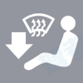
19. `兒童安全鎖`
    * 
20. `車門鎖住開鎖開關`
    * 
21. `制動系統出現異常或故障`
    * 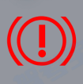
22. `駐車制動器處於制動狀態`
    * 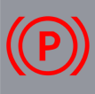
23. `ABS系統故障`
    * 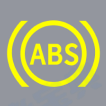
24. `冷卻液不足`
    * 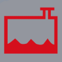
25. `發動機溫度過高`
    * 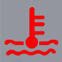
26. `充電電路故障`
    * 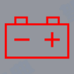
27. `發動機控制系統故障`
    * 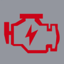
28. `安全氣囊處於故障狀態`
    * 
29. `機油壓力過低or機油量不足`
    * 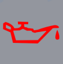
30. `燃油已到最低液面`
    * 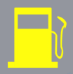

### 口訣

1. 前`行李艙蓋`，後`發動機蓋`，兩側`車門`
2. 內部`內循環`，外內`外循環`
3. 前扇後方，上方弧形`洗滌器`，向上箭頭`除霧`
4. 向頭`迎面`，向下`地板`，`有窗`吹玻璃
5. 紅!`制動故障`，紅P`制動器處於制動`，紅色三鋒`冷卻液`，紅色鑰匙`發動機高溫`，紅色正負`充電故障`，紅色閃電`發動機控制故障`，紅壺滴`低機油壓or缺機油`